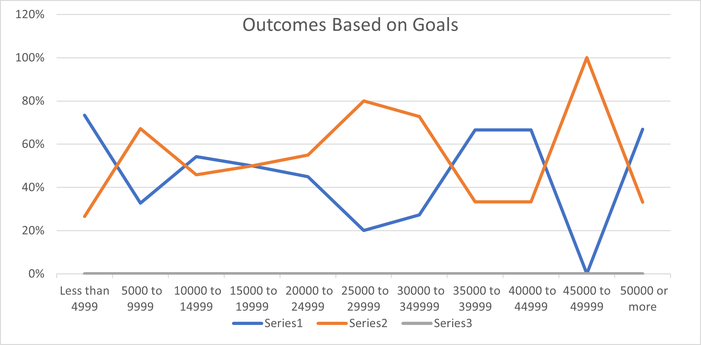

# An Analysis of Kickstarter Campigns

## Performing analysis on Kickstarter data to uncover trends

### Looking at data sets of theatre based kickstarter campaigns to determine how to launch a successful campaign

## The data for the kickstarter campaigns was analyzed looking at different factors including, date launched, type of kickstarter, and success or fail percentages. The data was broken down into the "theatre" category to give a more specific look at the data that corresponds to your needs for the campaign you hope to launch. The data was also filtered to look specifically at US based theatre campaigns to get as specific to your personal campaign as possible.

### I've included two different charts to give you a more visual idea of the analysis of the specific data. One chart titled "Outcomes Based on Launch Date" show the success and fail rates specific to the launch dates. As you can see, the more successful launches started in late spring. We also noticed a trend in less successful launches as the year went on into the fall and winter months. The second chart titled "Outcomes Based on Goals" gives the visual data on the success and fail trends specifically for plays based on their goal amount.

### Based on the data, many of the successful campaigns reached their goal after having been live about a month. The campaigns launched in the spring seemed to have the most success with reaching their funding goal. The highest percentage of successfully funded campaigns were the campaigns with goal amounts less than $4999. However, there was a trend of more plays being funded as their goal amount became higher than $35,000.

### The Outcomes Based on Goal data gives small insight into which dollar amount resulted in a successfully funded campaign. This should give you an idea of what to expect when starting your campaign. The launch date should also play a large role on when you choose to launch your personal campaign. One of the challenges will be the variables that are not able to be analyized, such as personal connections to the donors, specific region the campaign in based, popularity of the topic to the crowd in which the campaign was marketed, etc.

## Results

- What are two conclusions you can draw about the Outcomes based on Launch Date?
     There were more campaigns launched in the spring than any other time of year. 
     The campaigns that were launched in spring seemed to have the greater success to fail 
     ratio with there being more successful campaigns in the spring.

- What can you conclude about the Outcomes based on Goals?
     The campaigns with the most success had goals less than $4,999. However, goals that 
     exceeded the goal of $35,000 had a majority of a success rate of 67%.

- What are some limitations of this dataset?
     We were not able to see and filter the data based on particular regions in the country the 
     plays were set to perform. Having access to this data could determine if a play was more 
     successful based on if it were in a larger metro area or more rural based.

- What are some other possible tables and/or graphs that we could create? 
     We could create a more detailed chart showing the success to fail ratio based on the amount 
     of backers and their average donation.
 

